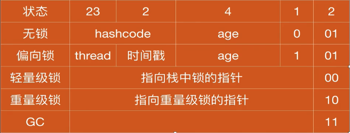

## JVM 运行时数据区

- 被所有线程共享的

  - 堆
  - 方法区
  - 运行时常量池
- 每个线程私有的

  - 本地方法栈
  - 虚拟机栈
  - 程序计数器
- 对象在堆中的组成

  1. 对象头

     - MarkWord
     - 类型指针
     - 数组长度(对象是数组时)
  2. 具体数据
  3. 对齐填充
- MarkWord 的结构(32位虚拟机)
  

无锁状态中的 HashCode 是懒加载，一个对象一旦计算过 `HashCode` 就不会成为偏向锁
而一个偏向锁状态的对象，一旦计算过 `HashCode` 就会立即升级为重量级锁
锁只能升级不能降级，无锁 -> 偏向锁 -> 轻量级锁 -> 重量级锁

- JVM 堆的结构划分
  - 新生代
    - eden(80%)
    - from(10%)
    - to(10%)
  - 老年代

对象会在新生代的 eden 区域中创建(大对象会直接进入老年代)，第一次 eden 区满了以后进心 minorGC 将存活对象 age + 1。
然后放入 from 区域，将 eden 清空
以后每次 minorGC 都将 eden 和 from 中的存活对象 age + 1，然后放入 to 区域，再将 to 和 from 区域相互对调
age 达到一定值时会移动到老年代
在 minorGC 时，存活对象大于 to 区域的也会直接进入老年代。

- 垃圾回收算法
  - 标记-清除算法(先标记要回收的对象，然后清除，会产生空闲内存碎片)
  - 标记-整理算法(将不回收的对象依次整理覆盖掉被回收的对象，防止产生内存碎片)
  - 复制算法(将内存分成两个区域，第一个区域满后，将区域一上存活的对象复制到区域二上。效率最高，但是内存利用率低)
> JVM 中新生代使用复制算法，老年代使用标记整理算法

